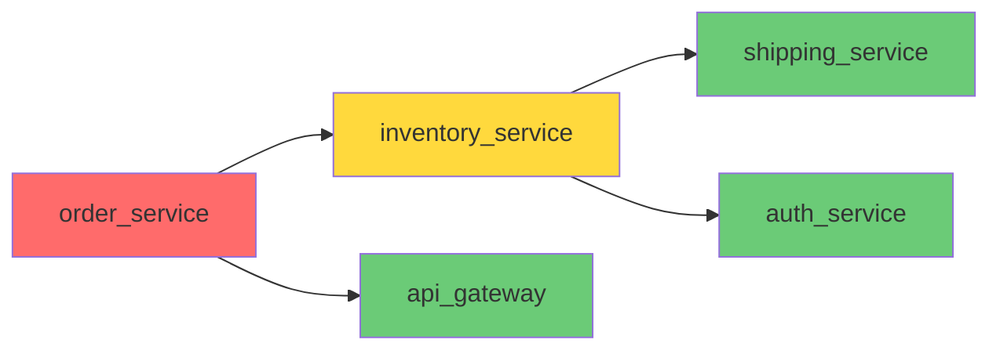

# 🔧 API Integration Debugging Environment

> **A real-world environment for training and evaluating AI agents on multi-service API debugging with cascading failures, dynamic state, and multi-dimensional grading.**

[](https://github.com/meta-pytorch/OpenEnv)
[](https://python.org)
[](LICENSE)

## Why API Debugging?

API integration failures are one of the most common and time-consuming issues in production software. When Service A calls Service B which calls Service C, a single misconfiguration can cascade through the entire system. Debugging requires:

- **Structured diagnosis**: inspecting logs, configs, and endpoints across services
- **Dependency awareness**: understanding which service failures affect which downstream services
- **Strategic reasoning**: fixing upstream issues first to unmask downstream problems

This environment simulates *real-world cascading API failures* — not toy string-matching puzzles.

## How It Works

```
┌─────────────────────────────────────────────────────────────┐
│                   Agent Debugging Loop                       │
│                                                              │
│  1. reset() → Initial observation with broken service state  │
│  2. step(inspect_logs) → Error logs from target service      │
│  3. step(inspect_config) → Current (broken) configuration    │
│  4. step(inspect_endpoint) → Live error response simulation  │
│  5. step(submit_fix) → Fix validation + cascade resolution   │
│  6. grade() → Multi-dimensional rubric score                 │
└─────────────────────────────────────────────────────────────┘
```

### Service Dependency Graphs

Each task models a real multi-service system with dependency chains:



**Red** = error, **Yellow** = degraded, **Green** = healthy. Fixing upstream issues changes downstream health.

## Environment Design

### Dynamic State

Unlike static environments, our state changes as the agent acts:

1. **Service health tracking**: Each service has a status (`healthy`, `degraded`, `error`) that updates when issues are fixed
2. **Dynamic logs**: After fixing an issue, re-inspecting logs shows *new entries* reflecting the fix
3. **Cascading effects**: Fixing an upstream issue can change downstream service behavior
4. **Error trace**: Shows the full error propagation chain, shrinking as issues are fixed

### Reward Shaping

| Action | Reward | Condition |
|--------|--------|-----------|
| `inspect_logs` (new service, finds issues) | +0.15 | New relevant error patterns found |
| `inspect_logs` (new service, no issues) | +0.05 | Valid inspection but no issues here |
| `inspect_logs` (repeat, unchanged) | 0.00 | No new information |
| `inspect_logs` (repeat, dynamic logs) | +0.05 | New logs appeared after a fix |
| `inspect_config` (service has issues) | +0.05 | Relevant configuration retrieved |
| `inspect_endpoint` | +0.02 to +0.05 | Endpoint testing |
| `submit_fix` (correct) | +0.25 | Issue resolved |
| `submit_fix` (correct + inspected first) | +0.30 | Diagnosis + fix strategy bonus |
| `submit_fix` (partial — close value) | +0.03 | Right key, close but not exact value |
| `submit_fix` (wrong) | -0.10 | Incorrect fix |
| All actions complete | +0.20 | Completion bonus |
| Every step | -0.01 | Step cost (encourages efficiency) |

## Tasks

### Easy: Payment API Integration (2 issues, 15 steps)

Payment client failing to connect to payment gateway. Issues involve authentication and protocol errors.

- **Issue pool**: 4 possible issues, 2 selected per episode
- **Services**: `payment_client`, `payment_gateway`
- **Issue types**: Auth header missing, wrong Content-Type, timeout, deprecated endpoint

### Medium: Webhook Event Chain (3 issues, 25 steps)

Webhook notification system dropping events across a 3-service chain.

- **Issue pool**: 5 possible issues, 3 selected per episode
- **Services**: `webhook_sender`, `webhook_receiver`, `notification_service`
- **Issue types**: Rate limiting, retry misconfiguration, webhook signature, endpoint URL, compression
- **Dependencies**: Retry issue is masked by rate limit — must fix rate limit first

### Hard: E-Commerce Order Pipeline (5 issues, 40 steps)

Complex order processing pipeline with cascading failures across 5 services.

- **Issue pool**: 7 possible issues, 5 selected per episode
- **Services**: `order_service`, `inventory_service`, `shipping_service`, `api_gateway`, `auth_service`
- **Issue types**: Deprecated URLs, timeouts, race conditions, expired tokens, missing token refresh, circuit breakers, idempotency
- **Dependencies**: Timeout masked by wrong URL; token refresh masked by expired token

## Grading Rubric

The grader uses a **multi-dimensional rubric**, not a simple fix ratio:

| Dimension | Weight | Description |
|-----------|--------|-------------|
| **Fix Score** | 40% | `issues_fixed / total_issues` |
| **Diagnosis Score** | 20% | Did the agent inspect the service before fixing it? |
| **Efficiency Score** | 15% | `remaining_steps / max_steps` — faster is better |
| **Strategy Score** | 25% | Logical debugging approach: inspect before fix, avoid repeats, follow dependency order, use all action types |

```
Final Score = fix × 0.40 + diagnosis × 0.20 + efficiency × 0.15 + strategy × 0.25
Clamped to (0.001, 0.999)
```

### Baseline Scores

| Task | Score | Steps | Issues Fixed |
|------|-------|-------|--------------|
| Easy | ~0.75 | 7 | 2/2 |
| Medium | ~0.55 | 10 | 3/3 |
| Hard | ~0.45 | 15 | 5/5 |

*Baseline uses a rule-based heuristic agent (inspect all → fix all).*

## Action & Observation Spaces

### Action Space

```json
{
  "action_type": "inspect_logs | inspect_config | inspect_endpoint | submit_fix",
  "target": "service_name",
  "fix_payload": {
    "config_key": "corrected_value"
  }
}
```

### Observation Space

```json
{
  "task_id": "easy",
  "task_description": "...",
  "logs": ["[ERROR] ..."],
  "config_snapshot": {"headers": {"Content-Type": "text/plain"}},
  "api_response": {"status": "error", "status_code": 401},
  "service_status": {"payment_client": "error", "payment_gateway": "healthy"},
  "dependency_graph": {"payment_client": ["payment_gateway"]},
  "error_trace": ["[CRITICAL] payment_client: Missing Authorization header"],
  "remaining_steps": 14,
  "issues_found": 1,
  "issues_fixed": 0,
  "issues_total": 2,
  "hints": ["Check headers.Authorization"],
  "available_targets": ["payment_client", "payment_gateway"]
}
```

## Example Transcript

```
>>> reset(task_id="easy")
task_description: "Payment processing API integration is failing..."
service_status: {payment_client: "error", payment_gateway: "healthy"}
error_trace: [
  "[CRITICAL] payment_client: Missing Authorization header",
  "  └─> payment_gateway: All requests rejected with 401",
  "[ERROR] payment_client: Wrong Content-Type (text/plain instead of application/json)",
  "  └─> payment_gateway: Request body parsing fails"
]

>>> step(inspect_logs, target=payment_client)
logs: ["[ERROR] POST /process -> 401 Unauthorized", ...]
issues_found: 2, reward: +0.15

>>> step(inspect_config, target=payment_client)  
config: {headers: {Content-Type: "text/plain", Accept: "..."}, ...}
reward: +0.05

>>> step(submit_fix, target=payment_client, fix_payload={headers.Authorization: "Bearer sk_key"})
action_result: "Fix accepted! Fixed 1 issue(s)."
service_status: {payment_client: "degraded"}  # still has content-type issue
reward: +0.30

>>> step(inspect_logs, target=payment_client)  # re-inspect shows new logs!
logs: [...original..., "[INFO] Authorization header set. Retrying request..."]
reward: +0.05  # reward for checking updated state

>>> step(submit_fix, target=payment_client, fix_payload={headers.Content-Type: "application/json"})
action_result: "Fix accepted! All issues fixed! Episode complete. 🎉"
service_status: {payment_client: "healthy", payment_gateway: "healthy"}
error_trace: ["All issues resolved. No error cascades active."]
reward: +0.50 (fix + completion bonus)

>>> grade()
score: 0.82 (fix=1.0, diagnosis=1.0, efficiency=0.67, strategy=0.8)
```

## Setup & Usage

### Install Dependencies

```bash
cd api_debug_env  # or project root
uv sync
```

### Run Locally

```bash
uvicorn server.app:app --reload --port 8000
```

### Run Tests

```bash
python -m pytest tests/ -v --tb=short
```

### Docker

```bash
docker build -t api_debug_env -f server/Dockerfile .
docker run -p 8000:8000 api_debug_env
```

### API Endpoints

| Endpoint | Method | Description |
|----------|--------|-------------|
| `/` | GET | Environment info + status |
| `/reset` | POST | Reset environment |
| `/step` | POST | Execute an action |
| `/state` | GET | Get current state |
| `/tasks` | GET | List all tasks with schemas |
| `/grader` | POST | Get grading score |
| `/baseline` | POST | Run baseline agent |
| `/health` | GET | Health check |

### Run Inference

```bash
export HF_TOKEN=your_token_here
python inference.py
```

## Design Philosophy

This environment is designed to be useful for **RL/agent training**, not just evaluation:

1. **Dense Rewards**: Every action type can yield positive or negative reward, enabling gradient-based training
2. **Progressive Difficulty**: Easy→Medium→Hard with increasing service count and dependency complexity
3. **Partial Credit**: Close-but-wrong fixes get feedback instead of binary rejection
4. **Strategy Incentives**: The multi-dimensional rubric rewards *how* the agent solves, not just *what* it solves
5. **Stochastic**: Seed-based randomization prevents policy overfitting to memorized scenarios
6. **Cascading Dynamics**: Upstream fixes change downstream state, requiring multi-step reasoning

## Project Structure

```
├── models.py                       # Pydantic Action & Observation definitions
├── scenarios.py                    # Task scenarios with dependency graphs
├── inference.py                    # MANDATORY baseline inference script
├── openenv.yaml                    # OpenEnv metadata
├── pyproject.toml                  # Dependencies
├── server/
│   ├── api_debug_env_environment.py  # Core environment logic
│   ├── app.py                      # FastAPI endpoints
│   └── Dockerfile                  # HF Spaces deployment
└── tests/
    └── test_environment.py         # 48+ unit & integration tests
```
